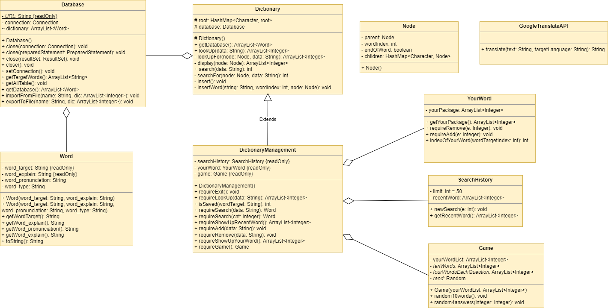
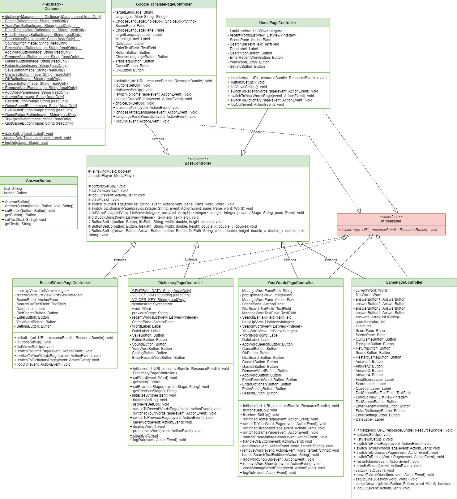

# App học Tiếng Anh MyCuteDict (Dự án chính ở branch nguyen)
>Bài tập môn OOP - Nhóm 8

## Contributors
- Khuất Bảo Nguyên - 22026508
- Trần Bảo Ngọc - 22026516
- Nguyễn Hương Giang - 22026566

## Sơ đồ cây thừa kế
>[drawio](https://drive.google.com/file/d/1tqFMMrJH-Wwlo196BQFnD1s2UjnQV4Is/view?usp=sharing): Sơ đồ cây thừa kế (Có 2 tab backend và frontend)
- Mở [drawio](https://app.diagrams.net/#G1tqFMMrJH-Wwlo196BQFnD1s2UjnQV4Is) để truy cập.

***Hình ảnh minh họa***
***Backend***

***Frontend***

## References
- Design: Sử dung [canva](https://www.canva.com/) và [flaticon](https://www.flaticon.com/)
